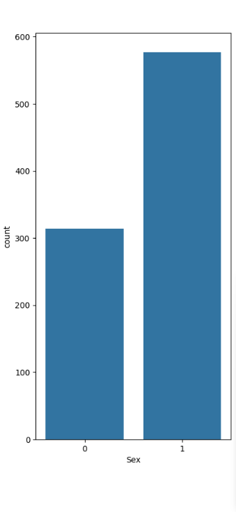
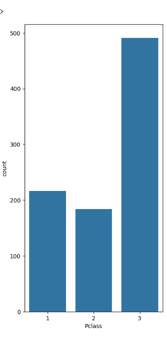
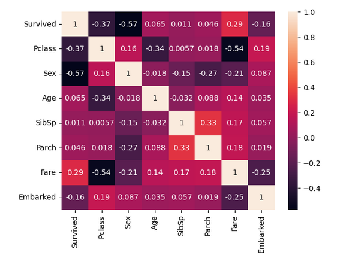

<div align="center">

# 🚢 Titanic Survival ML

A machine learning project on the Kaggle Titanic dataset covering EDA, feature engineering, label encoding, and classification models (Logistic Regression & Random Forest) to predict passenger survival.

<p align="center">


</p>

</div>

---

## 📖 Overview

**Titanic Survival ML** is an end to end machine learning classification project built on the iconic [Kaggle Titanic dataset](https://www.kaggle.com/c/titanic). Starting from raw passenger data, the notebook walks through data cleaning, exploratory analysis, feature engineering, categorical encoding, model training, and evaluation - making it a solid reference for anyone learning supervised ML with scikit-learn.

---

## 🖼️ EDA Snapshots

| Survival by Gender | Survival by Passenger Class | Feature Correlation Heatmap |
|--------------------|------------------------------|------------------------------|
|  |  |  |
| <p align="center"><b>Gender Analysis</b></p> | <p align="center"><b>Pclass Analysis</b></p> | <p align="center"><b>Correlation Matrix</b></p> |

---

## 📓 Open the Notebook

| Viewer | Link |
|--------|------|
| **NBViewer** (static render) | [View on NBViewer](https://nbviewer.org/github/MusaIslamFahad/Titanic_Survival_Prediction/blob/main/Titanic%20Survival%20Prediction/titanic.ipynb) |
| **Google Colab** (run in browser) | [](https://colab.research.google.com/github/MusaIslamFahad/Titanic_Survival_Prediction/blob/main/Titanic%20Survival%20Prediction/titanic.ipynb) |

> _Update the notebook filename in the links above to match your actual `.ipynb` filename_

---

## 📊 Dataset

The project uses the **Kaggle Titanic Dataset** - 891 passengers in the training set, each with the following features:

| Feature | Type | Description |
|---------|------|-------------|
| `PassengerId` | Integer | Unique passenger identifier |
| `Survived` | Integer | Target- 0 = No, 1 = Yes |
| `Pclass` | Integer | Ticket class (1 = 1st, 2 = 2nd, 3 = 3rd) |
| `Name` | String | Passenger name |
| `Sex` | String | Gender- encoded to numeric |
| `Age` | Float | Age in years (has missing values) |
| `SibSp` | Integer | Number of siblings/spouses aboard |
| `Parch` | Integer | Number of parents/children aboard |
| `Ticket` | String | Ticket number |
| `Fare` | Float | Passenger fare |
| `Cabin` | String | Cabin number (high missingness - encoded/dropped) |
| `Embarked` | String | Port of embarkation - C, Q, or S (encoded) |

---

## 🔬 ML Pipeline

```
Raw CSV Data
     │
     ▼
① Data Loading & Inspection
     │  → Shape, dtypes, missing value counts
     ▼
② Exploratory Data Analysis (EDA)
     │  → Survival rates by Sex, Pclass, Age, Embarked
     │  → Correlation heatmap
     │  → Distribution plots
     ▼
③ Data Preprocessing
     │  → Fill missing Age (median), Embarked (mode)
     │  → Drop Cabin (too many nulls) or encode
     │  → Drop non-informative columns (Name, Ticket, PassengerId)
     ▼
④ Feature Encoding
     │  → Label encode Sex (male=0, female=1)
     │  → Label encode Embarked (C=0, Q=1, S=2)
     ▼
⑤ Train / Test Split
     │  → 80% train, 20% test (random_state=42)
     ▼
⑥ Model Training
     │  → Logistic Regression
     │  → Random Forest Classifier
     ▼
⑦ Evaluation
        → Accuracy score
        → Classification report (Precision, Recall, F1)
        → Confusion matrix
```

---

## 🤖 Models & Results

| Model | Accuracy |
|-------|----------|
| Decision Tree Classifier | _~94%_ |
| K-Nearest Neighbor | _~82%_ |
| Logistic Regression | _~81%_ |
| Support Vector Machine (SVM) | _~70%_ |


**Decision Tree Classifier** typically outperforms other models

---

## 🛠️ Tech Stack

| Library | Purpose |
|---------|---------|
| `pandas` | Data loading, cleaning, manipulation |
| `numpy` | Numerical operations |
| `matplotlib` / `seaborn` | EDA visualizations |
| `scikit-learn` | Model training, encoding, evaluation |
| `Jupyter Notebook` | Interactive development environment |

---

## ⚙️ Requirements

- Python 3.7+
- `pandas`
- `numpy`
- `scikit-learn`
- `matplotlib`
- `seaborn`
- `jupyter`

---

## 🚀 Getting Started

**1. Clone the repository**
```bash
git clone https://github.com/MusaIslamFahad/titanic-survival-ml.git
cd titanic-survival-ml
```

**2. (Optional) Create a virtual environment**
```bash
python -m venv venv
source venv/bin/activate       # macOS / Linux
venv\Scripts\activate          # Windows
```

**3. Install dependencies**
```bash
pip install pandas numpy scikit-learn matplotlib seaborn jupyter
```

**4. Download the dataset**

Get the Titanic dataset from [Kaggle](https://www.kaggle.com/c/titanic/data) and place `train.csv` and `test.csv` inside the `Titanic Survival Prediction/` folder.

**5. Launch the notebook**
```bash
jupyter notebook
```

Then open the `.ipynb` file from the Jupyter browser interface.

---

## 📂 Project Structure

```
titanic-survival-ml/
│
├── Titanic Survival Prediction/
│   ├── titanic.ipynb        # Main Jupyter Notebook (EDA + ML pipeline)
│   ├── train.csv            # Kaggle training data (download separately)
│   └── test.csv             # Kaggle test data (download separately)
│
├── screenshots/             # EDA plot exports for the README
└── README.md
```

> **Note:** The Kaggle dataset files (`train.csv`, `test.csv`) are not committed to the repo. Download them from Kaggle and place them in the project folder before running the notebook.

---

## 📚 What You'll Learn

This project is a great beginner-to-intermediate reference for:

- Handling **missing values** (median/mode imputation, column dropping)
- **Label encoding** categorical features for ML models
- Performing **EDA**: finding patterns in survival rates across groups
- Training and comparing **classification models** with scikit-learn
- Reading **classification reports**: precision, recall, F1-score
- Interpreting a **confusion matrix**

---

## 🔮 Future Enhancements

- 🔧 **Feature engineering**: extract titles from names (Mr., Mrs., Miss.), create `FamilySize = SibSp + Parch`
- 🌲 **Hyperparameter tuning**: GridSearchCV / RandomizedSearchCV for Random Forest
- 📊 **Cross-validation**: k-fold CV for more robust accuracy estimates
- 🤝 **Ensemble models**: XGBoost, Gradient Boosting, or a Voting Classifier
- 📤 **Kaggle submission**: generate `submission.csv` and submit to the leaderboard
- 🌐 **Web app**: deploy the trained model with Flask or Streamlit for live predictions

---

## 🤝 Contributing

Contributions, suggestions, and improvements are welcome!

1. Fork the repository
2. Create a feature branch (`git checkout -b feature/your-feature`)
3. Commit your changes (`git commit -m 'Add your feature'`)
4. Push and open a Pull Request

---

## 🙏 Acknowledgments

- [Kaggle](https://www.kaggle.com/c/titanic) for the Titanic dataset
- [Scikit-learn](https://scikit-learn.org/) for the ML toolkit
- The open-source data science community for endless learning resources

---

## 👨‍💻 Author

**Musa Islam Fahad**
- GitHub: [@MusaIslamFahad](https://github.com/MusaIslamFahad)
- Kaggle: [Your Kaggle Profile](https://www.kaggle.com/mdmusaislamfahad01)

---

> ⭐ Found this useful for your own ML learning? A star helps others discover it too!
